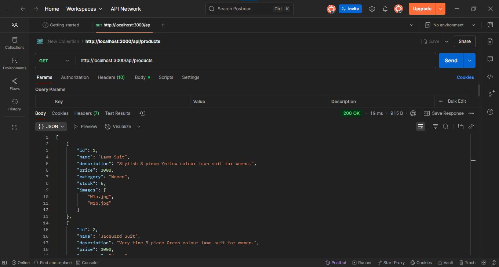

# AilaMahmood_FullStack_Week2
 Clothing Shop Backend (Node.js & Express)

 ✅ Objective
Build a **RESTful API** with basic CRUD functionality for managing **Products** in an online clothing store.

✅ Features
- Node.js + Express server
- REST API with:
  - GET all products
  - GET single product
  - POST new product
  - PUT update product
  - DELETE product

- In-memory data (no database yet)
- Organized folder structure
- Tested with Postman

✅ Folder Structure
    /Clothing-Backend
        /routes
        products.js
        /controllers
        productsController.js
        /data
        productsData.js
        server.js

✅ Product Data 
Products have:
  - id
  - name
  - description
  - price
  - category (Men/Women)
  - stock
  - images (array of 2 image filenames)

Example
```json
{
  "id": 1,
  "name": "Blue Shirt",
  "description": "Cotton blue shirt for men.",
  "price": 2000,
  "category": "Men",
  "stock": 10,
  "images": ["blue1.jpg", "blue2.jpg"]
}
```

✅ Installation
npm install

✅ Running the Server
node server.js
Server will start at:
   http://localhost:3000

✅ Available API Routes
📌 Get all products
    GET /api/products
📌 Get single product
    GET /api/products/:id
📌 Create new product
    POST /api/products
📌 Update existing product
    PUT /api/products/:id
📌 Delete product
    DELETE /api/products/:id

✅ Testing
Use Postman to test all routes.
Verified:
    GET all
    
    GET one
    POST new
    PUT update
    DELETE
