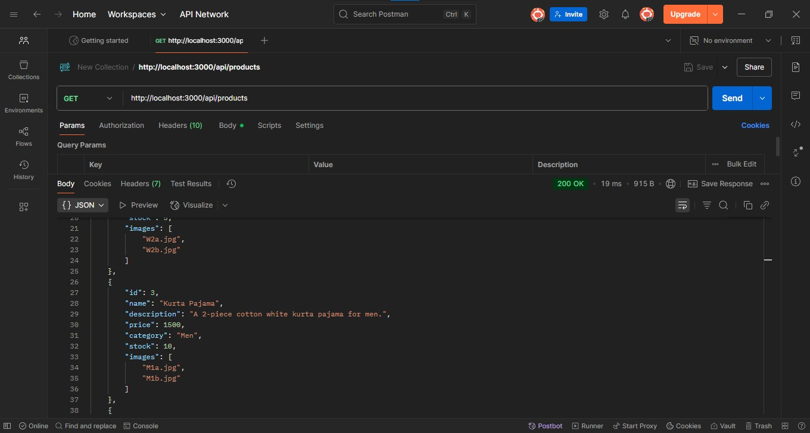
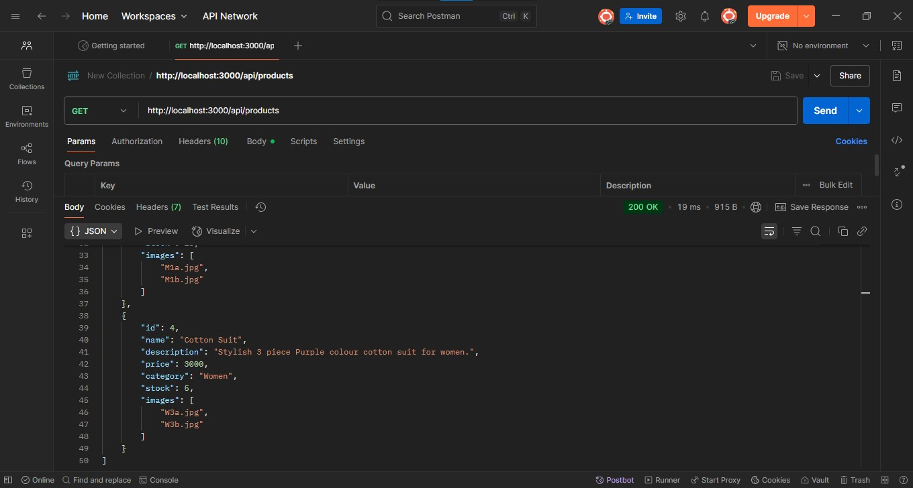
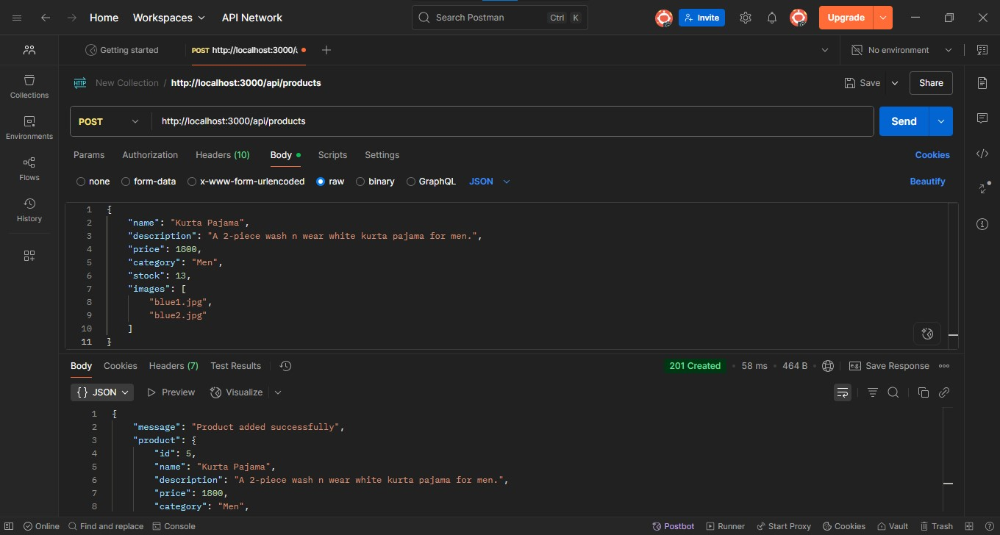
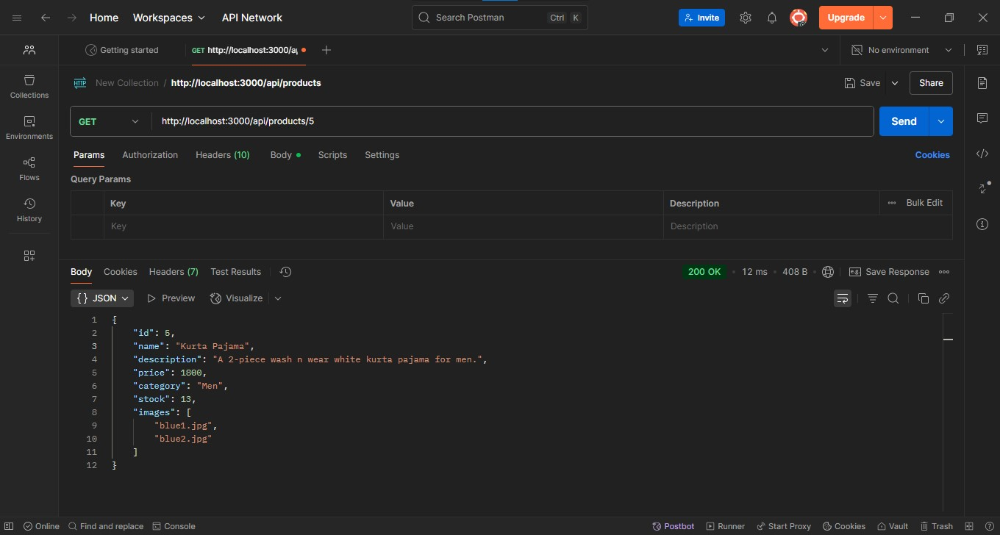
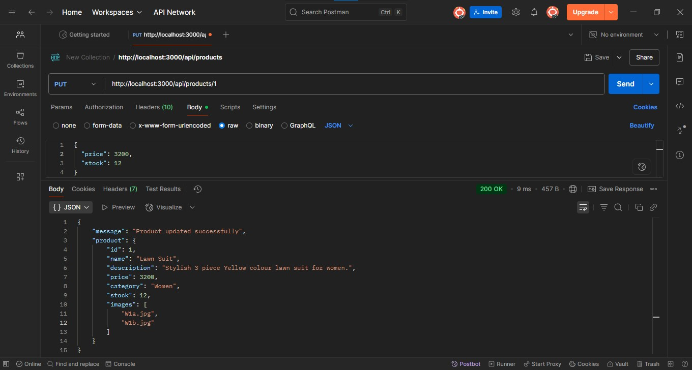
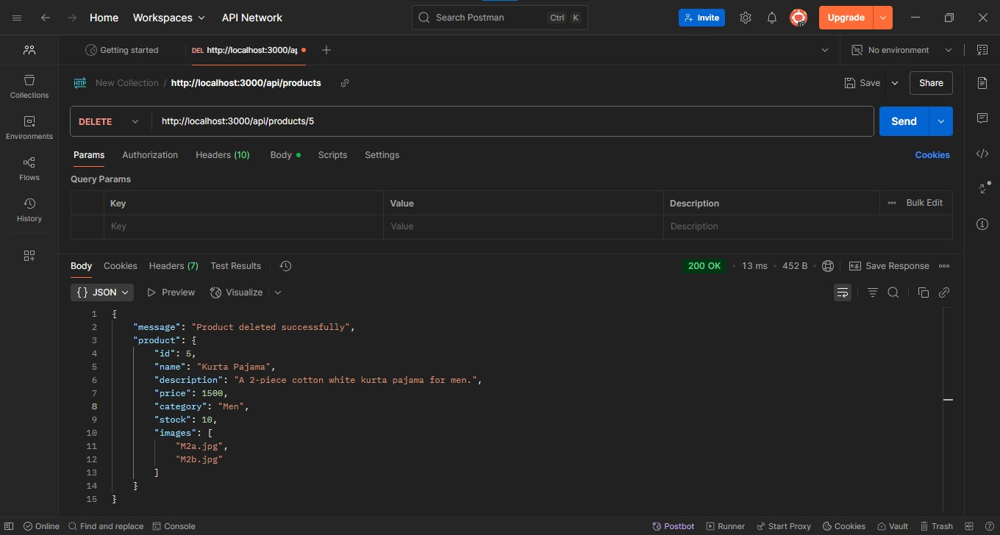
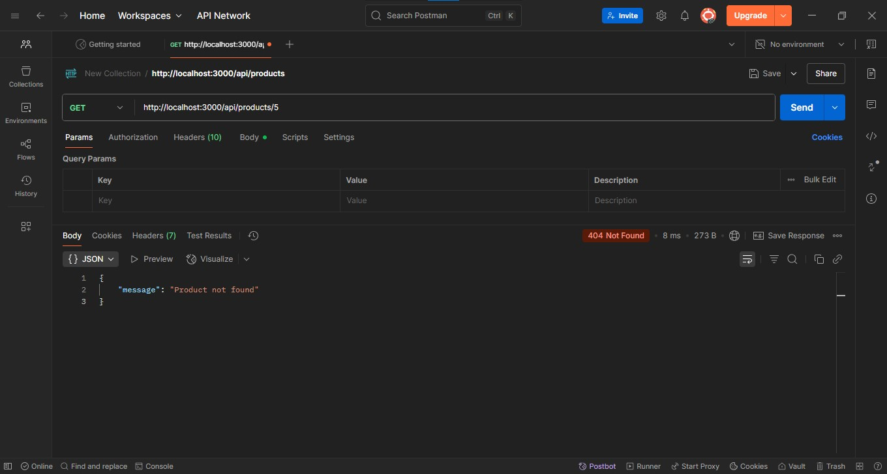

# AilaMahmood_FullStack_Week2
 Clothing Shop Backend (Node.js & Express)

 ✅ Objective
Build a **RESTful API** with basic CRUD functionality for managing **Products** in an online clothing store.

✅ Features
- Node.js + Express server
- REST API with:
  - GET all products
  - GET single product
  - POST new product
  - PUT update product
  - DELETE product

- In-memory data (no database yet)
- Organized folder structure
- Tested with Postman

✅ Folder Structure

    /Clothing-Backend
        /routes
        products.js
        /controllers
        productsController.js
        /data
        productsData.js
        server.js

✅ PRODUCT DATA 

Products have:
  - id
  - name
  - description
  - price
  - category (Men/Women)
  - stock
  - images (array of 2 image filenames)

Example
```json
{
  "id": 1,
  "name": "Blue Shirt",
  "description": "Cotton blue shirt for men.",
  "price": 2000,
  "category": "Men",
  "stock": 10,
  "images": ["blue1.jpg", "blue2.jpg"]
}
```

✅ INSTALLATION

npm install

✅ RUNNING THE SERVER

node server.js

Server will start at:

   http://localhost:3000

✅ Available API Routes

📌 Get all products

    GET /api/products

📌 Get single product

    GET /api/products/:id

📌 Create new product

    POST /api/products

📌 Update existing product

    PUT /api/products/:id

📌 Delete product

    DELETE /api/products/:id

✅ TESTING

Use Postman to test all routes.

Verified:
- GET all
     
    
      
- POST new
    
- GET one
       
- PUT update
    
- DELETE
    
- GET one
     
